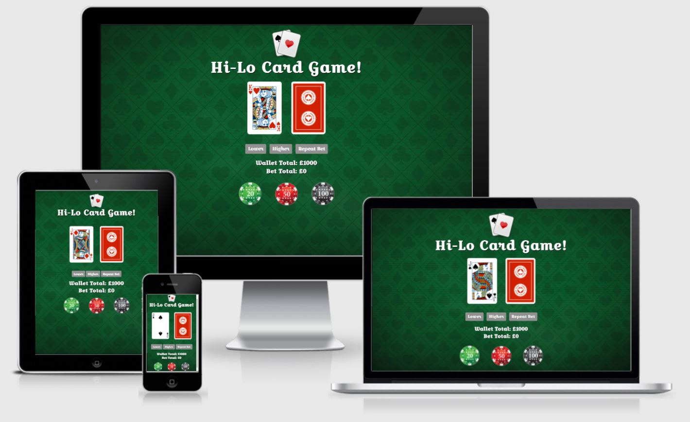
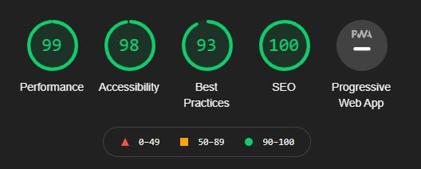
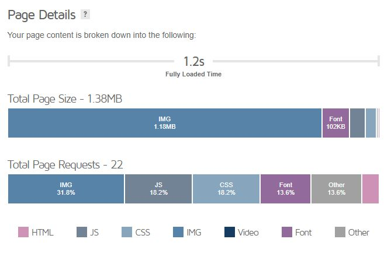

<h1><strong>Hi-Lo Card Game</strong></h1>

<h1>Product Description</h1>

My milestone 2 project for Code Institute is a Higher or Lower card game in which you have to decide whether the next card will be higher or lower than the last. There is betting feature which is used to increase your wallet total, which is what is used to generate your score at the end of the game. It is designed to be simplistic and engaging.

View the live project <a href="https://byates1289.github.io/Hi-Lo-MS2">here.</a>

<h1>Table of Contents</h1>
<ul>
    <li><a href="#user-experience">User Experience (UX)</a></li>
    <ul>
        <li><a href="#user-stories">User Stories</a></li>
    </ul>
    <li><a href="#design">Design</a></li>
    <ul>
        <li><a href="#colour-scheme">Colour Scheme</a></li>
        <li><a href="#typography">Typography</a></li>
        <li><a href="#imagery">Imagery</a></li>
        <li><a href="#wireframes">Wireframes</a></li>
    </ul>
    <li><a href="#features">Features</a></li>
    <li><a href="#technologies-used">Technologies Used</a></li>
    <li><a href="#frameworks">Frameworks Used</a></li>
    <li><a href="#testing">Testing</a></li>
        <ul>
            <li><a href="#code-verification">Code Verification</a></li>
            <li><a href="#lighthouse">Lighthouse</a></li>
            <li><a href="#speed-test">Speed Test</a></li>
            <li><a href="#testing-user-stories">Testing User Stories</a></li>
        </ul>
    <li><a href="#further-testing">Further Testing</a></li>
    <li><a href="#known-bugs">Known Bugs</a></li>
    <li><a href="#deployment">Deployment</a></li>
        <ul>
            <li><a href="#github-pages">GitHub Pages</a></li>
            <li><a href="#forking-repo">Forking the GitHub Repository</a></li>
            <li><a href="#making-local-clone">Making a Local Clone</a></li>
        </ul>
    <li><a href="#credits">Credits</a></li>
    <li><a href="#code">Code</a></li>
    <li><a href="#content">Content</a></li>
    <li><a href="#media">Media</a></li>
    <li><a href="#acknowledgements">Acknowledgements</a></li>
</ul>

<h2 id="user-experience">User Experience (UX)</h2>
<ul>
    <li id="user-stories">User Stories</li>
        <ul>
            <li id="ft-visitor">First Time Visitor Goals</li>
                <ol type="a">
                    <li>As a First Time Visitor, I want to understand how to play the card game Hi-Lo.</li>
                    <li>As a First Time Visitor, I want to play a game which I find enjoyable and simple to play.</li>
                    <li>As a First Time Visitor, I want to play a game with an element of risk</li>
                </ol>
            <li id="returning-visitor">Returning Visitor Goals</li>
                <ol type="a">
                    <li>As a Returning Visitor, I want to try and better my previous high-score.</li>
                    <li>As a Returning Visitor, I want to feel confident taking more calculated risks.</li>
                </ol>                       
        </ul>
    <li id="design">Design</li>
        <ul>
            <li id="colour-scheme">Colour Scheme</li>
                <ul>
                    <li>I've tried to theme the game as if it was being played at a Poker table at a Casino. There are a few variations of Green, Red and White which are largely from the images I've used in this project.</li>                         
                </ul>
            <li id ="typography">Typography</li>
                <ul>
                    <li>The Croissant One font is the main font used throughout this project with Cursive as the fallback font in case for any reason the font isn't being imported into the site correctly. The Roboto font is used within the Rules modal and SweetAlert2 popup.</li>
                </ul>
            <li id="imagery">Imagery</li>
                <ul>
                    <li>The images used really make the project feel authentic. The playing cards (especially the Royals), look particularly great! The background is a subtle image displaying the cards suits and goes well with the Poker table theme I was going for.</li>
                </ul>
            <li id="wireframes">Wireframes</li>
                <ul>
                    <li>Project Wireframe - <a href="https://github.com/BYates1289/Hi-Lo-MS2/blob/master/assets/docs/Wireframe.pdf">View</a></li>
                </ul>
            </li>
        </ul>
    </li>
</ul>
<h2 id="features">Features</h2>
<ul>
    <li>Responsive on all device sizes</li>
    <li>Interactivity for users. Higher or Lower buttons aswell as a betting feature.</li>
    <li>Saving of High-score</li>
</ul>
<h2 id="technologies-used">Technologies Used</h2>
<h3>Languages Used</h3>
<ul>
    <li>HTML5</li>
    <li>CSS3</li>
    <li>JavaScript</li>
</ul>
<h3 id="frameworks">Frameworks, Libraries & Programs Used</h3>
<ol>
    <li><a href="https://getbootstrap.com/docs/4.0/getting-started/introduction/">Bootstrap 4</a></li>
        <ul>
            <li>Bootstrap was used to assist with the responsiveness and styling of the website.</li>
        </ul>
    <li><a href="https://ianlunn.github.io/Hover/">Hover.css</a></li>
        <ul>
            <li>Hover.css was used on the Higher, Lower and Repeat Bet buttons and also the £20, £50 and £100 betting chips.</li>
        </ul>
    <li><a href="https://fonts.google.com/">Google Fonts</a></li>
        <ul>
            <li>Google Fonts was used to import the 'Croissant One' and 'Roboto' fonts into my project. 'Croissant One' was used for the majority of body text, whilst 'Roboto' was used for the rules modal and alert popup.</li>
        </ul>
    <li><a href="https://fontawesome.com/">Font Awesome</a></li>
        <ul>
            <li>Font Awesome was used to display a restart icon once the game has ended.</li>
        </ul>
    <li><a href="https://jquery.com/">jQuery</a></li>
        <ul>
            <li>jQuery is a dependency of the Bootstrap framework and helps with responsive design. </li>
        </ul>
    <li><a href="https://sweetalert2.github.io/">SweetAlert2</a></li>
        <ul>
            <li>SweetAlert2 was used to style the standard JavaScript alert popup.</li>
        </ul>
    <li><a href="https://tinypng.com/">TinyPNG</a></li>
        <ul>
            <li>TinyPNG was used to compress all images, resulting in faster loading times.</li>
        </ul>
    <li><a href="https://git-scm.com/">Git</a></li>
        <ul>
            <li>Git was used for version control by utilizing the Gitpod terminal to commit to Git and Push to GitHub.</li>  
        </ul>
    <li><a href="https://github.com/">GitHub</a></li>
        <ul>
            <li>GitHub is used to store the projects code after being pushed from Git.</li>
        </ul>
    <li><a href="https://balsamiq.com/">Balsamiq</a></li>
        <ul>
            <li>Balsamiq was used to create the wireframes during the design process.</li>
        </ul>
    <li><a href="https://developer.chrome.com/docs/devtools/">Chrome DevTools</a></li>
        <ul>
            <li>Absolutely essential tool for debugging code.</li>
        </ul>
        <li><a href="https://code.visualstudio.com/">VS Code</a></li>
        <ul>
            <li>Used for testing offline, when internet connectivity wasn't always available due to travel.</li>
        </ul>
</ol>
<h2 id="testing">Testing</h2>
<h3 id="code-verification">Code Verification</h3>

The W3C Markup Validator, W3C CSS Validator and JSHint services were used to validate code to ensure there were no syntax errors in the project.

<ul>
    <li>W3C Markup Validator - <a href="https://github.com/BYates1289/Hi-Lo-MS2/blob/master/assets/docs/HTML.pdf">Results</a></li>
    <li>W3C CSS Validator - <a href="https://github.com/BYates1289/Hi-Lo-MS2/blob/master/assets/docs/CSS.pdf">Results</a></li>
    <li>JSHint - <a href="https://github.com/BYates1289/Hi-Lo-MS2/blob/master/assets/docs/JSHint.pdf">Results</a></li>
</ul>
<h3 id="lighthouse">Lighthouse</h3>

Performance of the site was analysed by <a href="https://developers.google.com/web/tools/lighthouse">Lighthouse</a>. Here are the results.

<h3 id="speed-test">Speed Test</h3>

Site speed test was performed by <a href="https://gtmetrix.com/">GTMetrix</a>. Here are the results.

Prior to the above, I was informed in a previous test that my images were not optimised and that should compress them. I used <a href="https://tinypng.com/">TinyPNG</a> for this, which resulted in 60% better performance.

<h3 id="testing-user-stories">Testing User Stories from User Experience (UX) Section</h3>
<ul>
    <li>First Time Visitor Goals</li>
        <ol type="I">
            <li>As a First Time Visitor, I want to find out how to play the card game Hi-Lo.</li>
                <ol type="a">
                    <li>Upon entering the site, users are automatically greeted with a clean Rules modal, which specifies the rules of the game and how to place a bet.</li>
                </ol>
            <li>As a First Time Visitor, I want to be able to enjoy the card game of Hi-Lo without a complicated interface.</li>
                <ol type="a">
                    <li>The site was designed to have a minimalistic look which should not feel too confusing for users.</li>
                    <li>All things displayed within the project all serve a purpose and are easily identifiable as to what their job is.</li>
                    <li>The authentic colour scheme and card images used ensure the game feels more real and enjoyable.</li>
                </ol>            
        </ol>
    <li>Returning Visitor Goals</li>
        <ol type="I">
            <li>As a Returning Visitor, I want to better my High-Score.</li>
                <ol type="a">
                    <li>Your High-Score will be shown to you after each game of Hi-Lo.</li>
                    <li>If you better your High-Score, it will overwrite the previous one and will remain saved into local storage until the browsers cache has been cleared.</li>
                </ol>
            <li>As a Returning Visitor, I want to take more calculated risks when playing Hi-Lo.</li>
                <ol type="a">
                    <li>If you are confident in your selections you can increase your bet up to the maximum stake of £1000 each turn.</li>
                    <li>Users can make use of the Repeat Bet button after a large stake for an increased risk. You could use this throughout the game instead changing your bet amount each turn.</li> 
                </ol>            
        </ol>
</ul>
<h3 id="further-testing">Further Testing</h3>
<ul>
    <li>The site was tested on all modern browsers such as Google Chrome, Microsoft Edge, Safari and Opera and experienced no issues.</li>
    <li>The website was viewed on a variety of devices such as Desktop, Laptop, Surface Pro 6, iPad Air 2 & iPhone X.</li>
    <li>I did a large amount of offline testing using VS Code when creating this project and it's content.</li>
    <li>Family members were asked to review the site and to point out any bugs and/or user experience issues. One feedback I did get from my 7 year old son, was that it's unfair that it's not real money! :grin:</li>
</ul>
<h3 id="known-bugs">Known Bugs</h3>
<ul>
    <li>Starting a new game refreshes the page causing the Rules modal to reappear.</li>
</ul>
<h2 id="deployment">Deployment</h2>
<h3 id="github-pages">GitHub Pages</h3>

The project was deployed to GitHub Pages using the following steps...

<ol>
    <li>Log in to GitHub and locate the GitHub Repository.</li>
    <li>At the top of the Repository (not top of page), locate the "Settings" Button on the menu.</li>
    <li>Scroll down the Settings page until you locate the "GitHub Pages" Section.</li>
    <li>Under "Source", click the dropdown called "None" and select "Master Branch".</li>
    <li>The page will automatically refresh.</li>
    <li>Scroll back down through the page to locate the now published site link in the "GitHub Pages" section.</li>
</ol>
<h3 id="forking-repo">Forking the GitHub Repository</h3>

By forking the GitHub Repository we make a copy of the original repository on our GitHub account to view and/or make changes without affecting the original repository by using the following steps...

<ol>
    <li>Log in to GitHub and locate the GitHub Repository.</li>
    <li>At the top of the Repository (not top of page) just above the "Settings" Button on the menu, locate the "Fork" Button.</li>
    <li>You should now have a copy of the original repository in your GitHub account.</li>
</ol>
<h3 id="making-local-clone">Making a Local Clone</h3>
<ol>
    <li>Log in to GitHub and locate the GitHub Repository.</li>
    <li>Under the repository name, click "Clone or download".</li>
    <li>To clone the repository using HTTPS, under "Clone with HTTPS", copy the link.</li>
    <li>Open Git Bash</li>
    <li>Change the current working directory to the location where you want the cloned directory to be made.</li>
    <li>Type <code>git clone</code>, and then paste the URL you copied in Step 3.</li> 
    
<pre><code>$ git clone https://github.com/YOUR-USERNAME/YOUR-REPOSITORY</pre></code>

    <li>Press Enter. Your local clone will be created.</li> 
    
    
    <pre><code>$ git clone https://github.com/YOUR-USERNAME/YOUR-REPOSITORY    
> Cloning into `CI-Clone`...
> remote: Counting objects: 10, done.
> remote: Compressing objects: 100% (8/8), done.
> remove: Total 10 (delta 1), reused 10 (delta 1)
> Unpacking objects: 100% (10/10), done.</pre></code>

</ol>

Click <a href="https://docs.github.com/en/github/creating-cloning-and-archiving-repositories/cloning-a-repository-from-github/cloning-a-repository#cloning-a-repository-to-github-desktop">here</a> to retrieve pictures for some of the buttons and more detailed explanations of the above process.

<h2 id="credits">Credits</h2>
<h3 id="code">Code</h3>
<ul>
    <li>Bootstrap 4: Bootstrap Library used throughout the project mainly to make site responsive using the Bootstrap Grid System.</li>
    <li>SweetAlert2 for their beautifully styled alert popups.</li>
    <li>Hoverr.css for the <i>hvr-grow</i> style for my interactive buttons.</li>
</ul>
<h3 id="content">Content</h3>
<ul>
    <li>All content was written by the developer.</li>
</ul>
<h3 id="media">Media</h3>
<ul>
    <li>The Logo used was downloaded from <a href="https://www.pikpng.com/transpng/iRmJwow/">here</a></li>
    <li>Playing cards were downloaded from <a href="http://acbl.mybigcommerce.com/52-playing-cards/">here</a></li>
    <li>Background image was downloaded from <a href="https://www.shutterstock.com/image-vector/poker-table-background-green-color-vector-1645872547">Shutterstock</a>.
</ul>
<h3 id="acknowledgements">Acknowledgements</h3>
<ul>
    <li>My work colleagues at <a href="https://www.sgworld.com/">SG World</a>, for their insightful feedback/pointers and also for my paid subscription to <a href="https://www.pluralsight.com/">Pluralsight</a>.
    <li><a href="https://www.pluralsight.com/">Pluralsight</a> and <a href="https://www.udemy.com/">Udemy</a> for their extremely good course materials.</li>
    <li>The <a href="https://codeinstitute.net/">Code Institute</a> Slack community and their wonderfully helpful nature.
</ul>